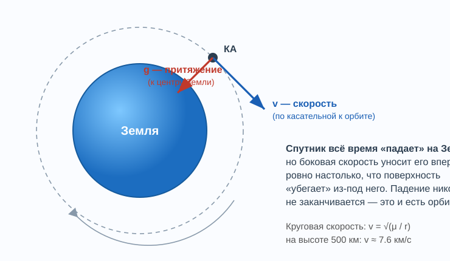
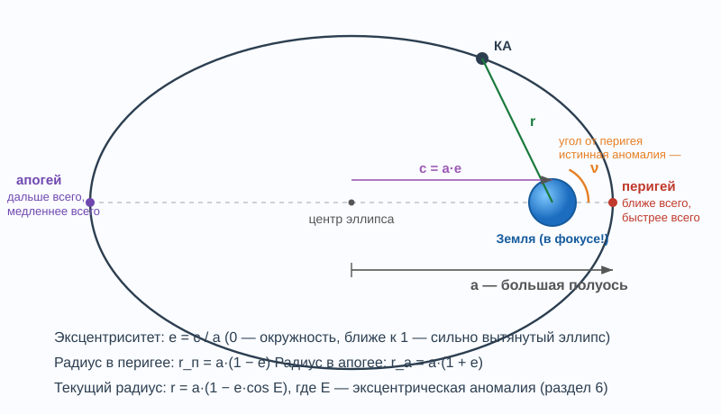
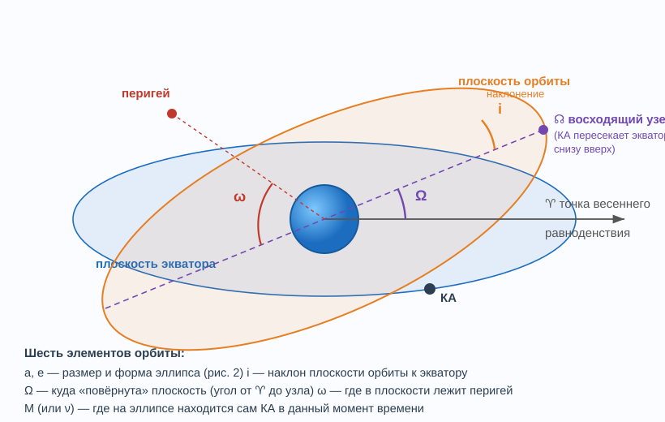
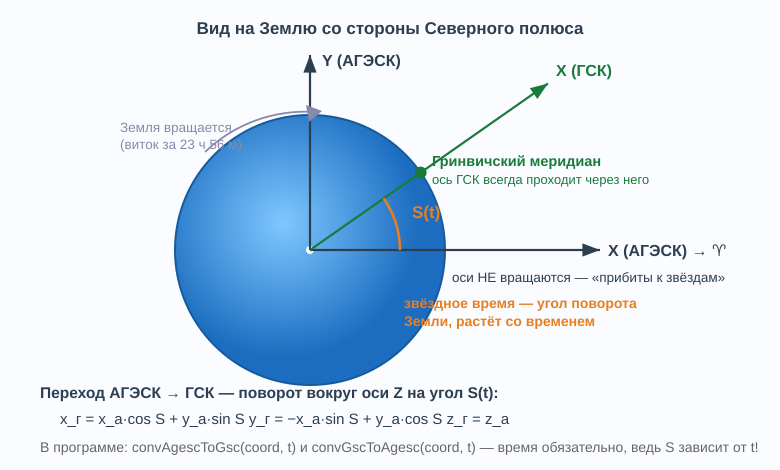
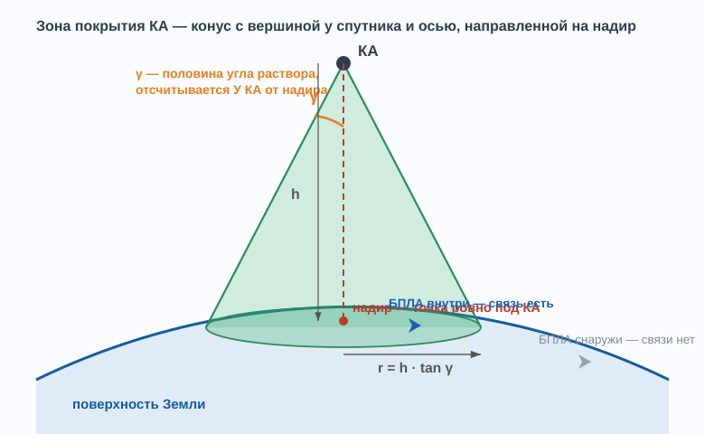
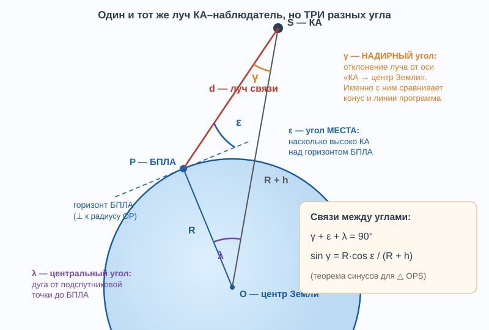
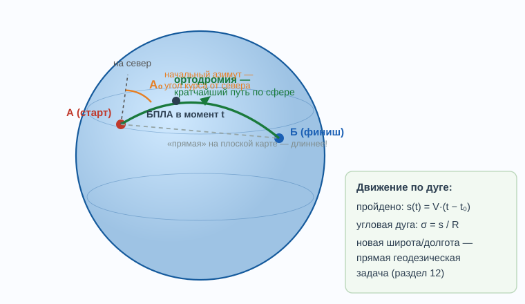
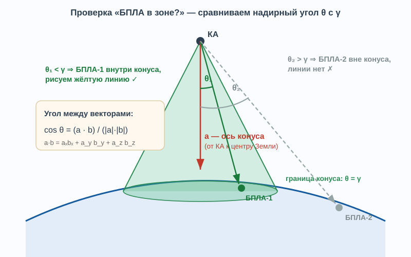

# Введение в моделирование орбитальной группировки

**Мини-пособие для начинающего: механика, математика и геометрия, заложенные в программу Kos**

Это пособие написано так, чтобы его можно было читать подряд, от простого к сложному.
Каждый раздел опирается на предыдущие. Все формулы, которые здесь разобраны,
реально работают в коде программы — в конце каждого раздела указано, **где именно**.
Если формула кажется сложной — смотрите на картинку и на числовой пример: они
всегда рядом.

---

## Содержание

1. [Что моделирует программа](#1-что-моделирует-программа)
2. [Словарь терминов](#2-словарь-терминов)
3. [Почему спутник не падает](#3-почему-спутник-не-падает)
4. [Эллипс и законы Кеплера](#4-эллипс-и-законы-кеплера)
5. [Шесть чисел, задающих орбиту](#5-шесть-чисел-задающих-орбиту)
6. [Где спутник сейчас: уравнение Кеплера](#6-где-спутник-сейчас-уравнение-кеплера)
7. [Системы координат и звёздное время](#7-системы-координат-и-звёздное-время)
8. [TLE — паспорт орбиты](#8-tle--паспорт-орбиты)
9. [Возмущения: почему чистого Кеплера мало](#9-возмущения-почему-чистого-кеплера-мало)
10. [Зона покрытия КА: конус и угол gamma](#10-зона-покрытия-ка-конус-и-угол-gamma)
11. [Надирный угол и угол места — два взгляда на один луч](#11-надирный-угол-и-угол-места--два-взгляда-на-один-луч)
12. [Движение БПЛА по дуге большого круга](#12-движение-бпла-по-дуге-большого-круга)
13. [Проверка «объект в зоне» через векторы](#13-проверка-объект-в-зоне-через-векторы)
14. [Дискретное время: как живёт симуляция](#14-дискретное-время-как-живёт-симуляция)
15. [Карта соответствия: формула → файл программы](#15-карта-соответствия-формула--файл-программы)
16. [Проверь себя](#16-проверь-себя)
17. [Что почитать дальше](#17-что-почитать-дальше)

---

## 1. Что моделирует программа

Программа Kos отвечает на один главный вопрос:

> **«В какие моменты времени какой спутник может связаться с объектом на Земле?»**

Для этого она моделирует три вещи и сводит их вместе:

```
 ┌──────────────────────┐   ┌──────────────────────┐   ┌──────────────────────┐
 │ 1. ДВИЖЕНИЕ КА       │   │ 2. ЗОНА ПОКРЫТИЯ КА  │   │ 3. ДВИЖЕНИЕ БПЛА     │
 │ по орбите (TLE/      │   │ конус радиовидимости │   │ по поверхности Земли │
 │ Кеплер), разделы 3–9 │   │ разделы 10–11        │   │ раздел 12            │
 └──────────┬───────────┘   └──────────┬───────────┘   └──────────┬───────────┘
            └──────────────────────────┼──────────────────────────┘
                                       ▼
                     ┌─────────────────────────────────────┐
                     │ 4. ПРОВЕРКА: БПЛА внутри конуса КА? │
                     │ раздел 13                           │
                     │ да → жёлтая линия связи в 3D        │
                     │     + отметка на графике            │
                     └─────────────────────────────────────┘
```

Всё это повторяется на каждом шаге модельного времени (раздел 14), поэтому на
экране спутники летят, Земля вращается, конусы скользят по поверхности, а линии
связи вспыхивают и гаснут.

---

## 2. Словарь терминов

| Термин | Что означает |
|---|---|
| **КА** | Космический аппарат, спутник |
| **ОГ** | Орбитальная группировка — множество КА одной системы (например, 66 спутников Иридиум) |
| **БПЛА** | Беспилотный летательный аппарат (в программе — объект, движущийся над поверхностью Земли) |
| **TLE** | Two-Line Elements — стандартный двухстрочный формат описания орбиты (раздел 8) |
| **Эпоха** | Момент времени, к которому «привязаны» орбитальные данные |
| **Надир** | Точка на Земле ровно под спутником; направление «вниз, на центр Земли» |
| **Зенит** | Направление «вверх» от наблюдателя, противоположно надиру |
| **Подспутниковая точка** | То же, что надир КА: след спутника на поверхности |
| **Угол места (elevation, ε)** | Насколько высоко объект над горизонтом наблюдателя: 0° — на горизонте, 90° — в зените |
| **Азимут** | Направление в горизонтальной плоскости, отсчитывается от севера |
| **Надирный угол (γ, θ)** | Угол при спутнике между направлением на надир и направлением на объект |
| **Gamma (γ)** | Половина угла раствора конуса покрытия КА — задаётся аппаратурой спутника |
| **Ортодромия** | Кратчайший путь между двумя точками по поверхности сферы (дуга большого круга) |
| **Перигей / апогей** | Ближайшая / самая дальняя точка орбиты от Земли |
| **μ (мю)** | Гравитационный параметр Земли: μ = GM = 398 600.44 км³/с² |
| **R** | Радиус Земли, в программе 6371 км (сферическая модель) |

---

## 3. Почему спутник не падает

Начнём с самого частого вопроса. Спутник **падает** — всё время. На него действует
только притяжение Земли (двигатели на орбите выключены). Но у него есть огромная
боковая скорость, и пока он «падает» на метр вниз, он смещается на километры вбок —
а Земля круглая, и её поверхность за это время «уходит» из-под него ровно на тот
же метр. Падение продолжается вечно и превращается в полёт по кругу.



**Сколько нужно скорости?** Для круговой орбиты притяжение должно в точности
играть роль центростремительной силы:

```
g = v²/r      где  g = μ/r²      ⇒      v = √(μ / r)
```

Числовой пример для высоты 500 км (r = 6371 + 500 = 6871 км):

```
v = √(398600.44 / 6871) = √58.01 ≈ 7.62 км/с    (около 27 400 км/ч)
```

**Период обращения** (третий закон Кеплера, встретим его ниже):

```
T = 2π·√(a³/μ) = 2π·√(6871³ / 398600.44) ≈ 5670 с ≈ 94.5 минуты
```

Отсюда важная закономерность, которая пронизывает всю программу:

> **Чем выше орбита — тем медленнее летит спутник и тем дольше период.**
> МКС (420 км) — 93 мин; Гонец (1500 км) — 116 мин; ГЛОНАСС (19 100 км) — 11.3 часа;
> геостационар (35 786 км) — ровно сутки, висит над одной точкой экватора.

---

## 4. Эллипс и законы Кеплера

Круговая орбита — частный случай. В общем случае орбита — **эллипс**, и Земля
находится не в его центре, а в **фокусе**. Это первый закон Кеплера.



Три величины описывают форму:

- **a** — большая полуось («средний размер» орбиты);
- **e** — эксцентриситет («вытянутость»): e = 0 — окружность, e = 0.7 — сильно
  вытянутый эллипс (например, орбита «Молния»);
- расстояние от центра до фокуса: c = a·e.

Отсюда крайние точки:

```
перигей:  r_п = a·(1 − e)          апогей:  r_а = a·(1 + e)
```

**Числовой пример.** У GONETS-M 3 из TLE: a ≈ 7864 км, e = 0.0017108. Тогда
r_п = 7864·0.99829 = 7851 км, r_а = 7864·1.00171 = 7877 км — разница всего 26 км,
орбита почти круговая. Это типично для спутников связи.

**Второй закон Кеплера:** радиус-вектор спутника заметает равные площади за равные
времена. Практическое следствие — **в перигее спутник летит быстрее всего,
в апогее — медленнее всего**. Для почти круговых орбит скорость почти постоянна.

**Третий закон Кеплера:** T² = (4π²/μ)·a³ — период зависит **только** от большой
полуоси. Не от эксцентриситета, не от наклонения. Именно этим законом программа
пользуется «в обратную сторону», когда достаёт высоту орбиты из TLE (раздел 8).

---

## 5. Шесть чисел, задающих орбиту

Эллипс из раздела 4 — плоская фигура. Но орбита живёт в трёхмерном пространстве:
её плоскость как-то наклонена и как-то повёрнута. Чтобы полностью задать положение
спутника, нужно ровно **шесть** чисел — как шесть степеней свободы.



| # | Элемент | Отвечает за | Наглядно |
|---|---------|-------------|----------|
| 1 | **a** — большая полуось | размер орбиты | «насколько высоко» |
| 2 | **e** — эксцентриситет | форму | «насколько вытянута» |
| 3 | **i** — наклонение | наклон плоскости к экватору | i = 0° — над экватором; i = 90° — через полюса; i = 82.5° у Гонца — почти полярная |
| 4 | **Ω** — долгота восходящего узла | поворот плоскости вокруг оси Земли | «через какой меридиан звёздного неба проходит орбита» |
| 5 | **ω** — аргумент перигея | ориентацию эллипса в его плоскости | «в какой точке орбиты находится перигей» |
| 6 | **M** — средняя аномалия | положение КА на эллипсе в момент эпохи | «где на кольце сидит спутник сейчас» |

Пояснения к двум самым неочевидным:

**Восходящий узел** — точка, где орбита пересекает плоскость экватора «снизу
вверх» (с юга на север). **Ω** — угол от опорного направления (точка весеннего
равноденствия ♈ — раздел 7) до этого узла. Если запустить два спутника с
одинаковыми a, e, i, но разными Ω — получатся одинаковые орбиты, повёрнутые
вокруг земной оси, как дольки апельсина. Именно так строится группировка
Иридиум: 6 плоскостей (6 разных Ω) по 11 спутников.

**Аномалии** называются «аномалиями» по историческим причинам — это просто углы,
задающие положение на эллипсе. Их три вида, и переход между ними — тема
следующего раздела.

---

## 6. Где спутник сейчас: уравнение Кеплера

Задача: известны элементы орбиты на эпоху t₀. Где спутник в момент t?

Хитрость в том, что спутник движется по эллипсу **неравномерно** (второй закон
Кеплера), поэтому нельзя просто написать «угол = скорость × время». Приходится
использовать три угла-посредника:

```
 время t                известна ЛИНЕЙНАЯ зависимость от времени
    │
    ▼
 M — средняя аномалия:      M(t) = M₀ + n·(t − t₀),    n = √(μ/a³)
    │
    │  уравнение Кеплера (решается численно!)
    ▼
 E — эксцентрическая аномалия:      M = E − e·sin E
    │
    │  явная формула
    ▼
 ν — истинная аномалия:      tan(ν/2) = √((1+e)/(1−e)) · tan(E/2)
    │
    ▼
 положение:   r = a·(1 − e·cos E),   далее поворот на ω, i, Ω → координаты x, y, z
```

**Тонкость №1: уравнение Кеплера не решается «в лоб».** В равенстве
`M = E − e·sin E` нельзя алгебраически выразить E. Его решают итерациями —
методом Ньютона:

```
E₀ = M
E_{k+1} = E_k − (E_k − e·sin E_k − M) / (1 − e·cos E_k)
```

**Числовой пример.** Пусть e = 0.1, M = 60° = 1.0472 рад.

| Итерация | E | Невязка E − e·sinE − M |
|---|---|---|
| 0 | 1.0472 (60.00°) | −0.0866 |
| 1 | 1.1384 (65.22°) | +0.0004 |
| 2 | 1.1380 (65.20°) | ~10⁻⁷ — готово |

Две итерации — и ответ с точностью до миллионных. Для почти круговых орбит
(e ~ 0.001) сходится ещё быстрее. Далее:

```
tan(ν/2) = √(1.1/0.9)·tan(32.60°) = 1.1055·0.6395 = 0.7070   ⇒   ν = 70.5°
r = a·(1 − 0.1·cos 65.2°) = 0.958·a
```

Обратите внимание: M = 60°, а истинный угол ν = 70.5°. Спутник «убежал вперёд»
от равномерного графика, потому что недавно прошёл перигей, где двигался быстрее.

**Тонкость №2: единицы углов.** Все тригонометрические функции работают в
радианах, а людям (и TLE) удобны градусы. В программе константы `DEG_TO_RAD` и
`RAD_TO_DEG`, и путаница между ними — классический источник багов (мы такой
находили: градусы, переданные в функцию, ожидавшую радианы — раздел 15).

**Где в программе:** `ASD/keplereq.cpp` (уравнение Кеплера),
`ASD/orbitalvehicle.cpp` — метод `getCurrPos(t)` выдаёт готовые координаты.

---

## 7. Системы координат и звёздное время

Вот где новички чаще всего запутываются, поэтому медленно.

**Проблема:** спутник летит по орбите, которая «прибита» к звёздам (плоскость
орбиты в пространстве почти неподвижна), а БПЛА и города «прибиты» к Земле,
которая под этой орбитой вращается. Значит, нужно минимум две системы координат
и правило перехода между ними.



| Система | Ось X смотрит | Вращается? | Кто в ней живёт в программе |
|---|---|---|---|
| **АГЭСК** (абсолютная геоцентрическая экваториальная) | на точку весеннего равноденствия ♈ | нет | КА, орбиты, конусы, линии видимости (`m_root_agsk`) |
| **ГСК** (гринвичская) | на гринвичский меридиан | да, вместе с Землёй | Земля, БПЛА, наземные пункты (`m_root_gsk`) |
| **GEO** (географическая) | — | — | широта/долгота/высота: удобно людям |
| **ТСК** (топоцентрическая) | привязана к наблюдателю | — | расчёт азимута и угла места |

**Точка весеннего равноденствия ♈** — направление с Земли на Солнце в момент
весеннего равноденствия. Это просто удобный «нуль» на небе, общий для всех.

**Звёздное время S(t)** — угол, на который Земля повёрнута относительно ♈ в
момент t. Растёт равномерно. Тонкость: полный оборот относительно звёзд Земля
делает не за 24 часа, а за **23 ч 56 мин 04 с** (звёздные сутки) — за сутки Земля
успевает ещё и сместиться по орбите вокруг Солнца, и относительно Солнца ей
приходится довернуться лишние ~4 минуты.

**Переходы:**

```
GEO → ГСК (сфера):                 АГЭСК → ГСК (поворот на S):
r = R + h                          x_г =  x_а·cos S + y_а·sin S
z = r·sin(широта)                  y_г = −x_а·sin S + y_а·cos S
x = √(r²−z²)·cos(долгота)          z_г =  z_а
y = √(r²−z²)·sin(долгота)
```

> **Золотое правило программы:** прежде чем сравнивать/соединять два объекта
> (мерить угол, рисовать линию) — приведи их координаты **в одну систему на один
> и тот же момент времени**. Половина исправленных багов в этом проекте —
> нарушения именно этого правила.

**Где в программе:** `ASD/asdcoordconvertor.cpp` — `convGeoToGsc`,
`convGscToAgesc(coord, t)`, `convAgescToGsc(coord, t)`, `convGscToSsc`,
`compSiderealTime(t)`. В 3D-сцене узел `m_root_gsk` каждый кадр поворачивается
на S(t) — так Земля и вращается.

---

## 8. TLE — паспорт орбиты

TLE — мировой стандарт обмена орбитальными данными (публикует NORAD/Space-Track,
зеркало — celestrak.org). Разберём реальную запись из файла `Gonez.txt` по байтам:

```
GONETS-M 3
1 38734U 12041B   25069.83186582  .00000025  00000+0  10465-3 0  9991
2 38734  82.4808 355.0127 0017108   0.3118 359.7971 12.44881413573013
```

**Строка 1 — «кто и когда»:**

| Поле | Значение | Расшифровка |
|---|---|---|
| `38734U` | номер NORAD | уникальный номер объекта в каталоге, U = несекретный |
| `12041B` | межд. обозначение | запущен в 2012 г., запуск №41, объект B |
| `25069.83186582` | **эпоха** | 2025 год, 69-е сутки (10 марта), доля суток 0.83186582 → 0.8319·24 ч = **19:57:53 UTC** |
| `.00000025` | dn/dt / 2 | скорость изменения ср. движения (торможение) |
| `10465-3` | B* | коэфф. торможения: 0.10465·10⁻³ (запись без точки и «e») |

**Строка 2 — «какая орбита» (все углы в градусах):**

| Поле | Значение | Это элемент из раздела 5 |
|---|---|---|
| `82.4808` | i — наклонение | почти полярная орбита |
| `355.0127` | Ω — долгота восх. узла | ориентация плоскости |
| `0017108` | e — эксцентриситет | **подразумевается «0.»**: e = 0.0017108 |
| `0.3118` | ω — аргумент перигея | |
| `359.7971` | M — средняя аномалия | где КА на эпоху |
| `12.44881413` | n — среднее движение | **витков в сутки** (вместо a!) |

**Тонкость: в TLE нет большой полуоси** — вместо неё среднее движение n.
Достаём a третьим законом Кеплера, по шагам:

```
Шаг 1. Период:            T = 86400 / n = 86400 / 12.44881413 = 6940.4 с  (115.7 мин)
Шаг 2. Большая полуось:   a = ( μ·T² / 4π² )^(1/3)
                          a = ( 398600.44 · 6940.4² / 39.478 )^(1/3) ≈ 7864 км
Шаг 3. Высота:            h = a − R = 7864 − 6371 ≈ 1493 км
```

Получили высоту орбиты Гонца ~1500 км — сходится со справочником. Ровно этот
расчёт программа делает в `CPaint3D::calc()` (`kep[0] − R_EARTH`), чтобы потом
вычислить предельный угол конуса (раздел 10).

**Чего в TLE НЕТ (важно!):** никаких данных о полезной нагрузке — ни угла
антенны gamma, ни мощности, ни частот. TLE описывает **только траекторию**.
Поэтому gamma в программе берётся из отдельного файла
`config/satellite_gamma_config.xml` (поиск по имени спутника), а если КА там не
найден — считается геометрически из высоты (раздел 10).

**Срок годности:** TLE — это «снимок» орбиты на эпоху. Из-за возмущений
(раздел 9) точность падает со временем; практический предел — дни, максимум
пара недель от эпохи. Моделировать движение на месяцы вперёд по старому TLE —
типичная ошибка.

---

## 9. Возмущения: почему чистого Кеплера мало

Законы Кеплера точны для идеального случая: точечная Земля, никакой атмосферы,
никакой Луны. Реальность вносит поправки — **возмущения**:

1. **Сжатие Земли (гармоника J2).** Земля — не шар, а слегка приплюснутый
   эллипсоид: экваториальный радиус на 21 км больше полярного. «Лишняя масса» на
   экваторе тянет орбиту, и её плоскость медленно **прецессирует**: узел Ω
   дрейфует со скоростью до нескольких градусов в сутки (знак и величина зависят
   от i и h). Красивое применение: подобрав i ≈ 98°, дрейф Ω делают равным
   годовому движению Солнца — получается **солнечно-синхронная орбита**, где
   спутник ДЗЗ пролетает над каждой точкой всегда в одно и то же местное время.

2. **Атмосферное торможение.** Даже на 400–800 км есть следы атмосферы. Орбита
   медленно «скручивается» вниз; за это в TLE отвечает коэффициент B*.

3. **Луна, Солнце, давление света** — заметны на высоких орбитах.

Поэтому для TLE используется не Кеплер, а модель **SGP4** (и SDP4 для орбит с
периодом > 225 мин): она аналитически учитывает J2–J4, торможение и
лунно-солнечные члены. Важно: TLE и SGP4 — «парный комплект»: элементы TLE
специально подогнаны под эту модель, подставлять их в чистого Кеплера —
значит терять точность.

**Где в программе:** `ASD/noradsgp4.cpp`, `ASD/noradsdp4.cpp` — сама модель;
`ASD/orbitalmotion.cpp` — выбор модели по типу исходных данных (`type_dat`:
0 — Кеплер, 1 — TLE/SGP4); `ASD/difeq.cpp` + `mathtools/asdrungekutta4.cpp` —
численное интегрирование для режима с явным учётом сил.

---

## 10. Зона покрытия КА: конус и угол gamma

Антенна спутника связи «светит» вниз конусом. Всё, что внутри конуса, — в зоне
покрытия; что снаружи — вне зоны. В программе это тот самый **зелёный конус**.



Конус задают три величины, связанные простой тригонометрией:

```
вершина — в КА,  ось — на надир,  полураствор — γ
радиус пятна на Земле:   r ≈ h · tan γ
```

**Тонкость №1: геометрический предел.** Увеличивая γ, мы расширяем конус, но
только до тех пор, пока его образующая не **коснётся горизонта Земли**. Дальше
расти некуда — луч уйдёт в космос мимо планеты. Предельный угол находится из
прямоугольного треугольника «КА — центр Земли — точка касания» (касательная
перпендикулярна радиусу):

```
sin γ_max = R / (R + h)          ⇒          γ_max = arcsin( R / (R + h) )
```

| КА | h, км | γ_max | Комментарий |
|---|---|---|---|
| МКС | 420 | 74.0° | низко — «видит» мало, но конус широкий |
| Иридиум | 780 | 62.9° | |
| Гонец-М | 1493 | 54.1° | посчитано из TLE в разделе 8 |
| ГЛОНАСС | 19 100 | 14.5° | высоко — «видит» треть планеты при узком γ |

Отсюда ответ на вопрос «почему конусы у разных TLE разные, если gamma одинаковая»:
даже при равных γ радиус пятна r = h·tanγ зависит от **высоты**, а высота у
каждой группировки своя. А ещё программа ограничивает γ сверху величиной
γ_max − 0.5°, иначе tan γ у горизонта устремляется в бесконечность и конус
«взрывается» (этот баг мы чинили — журнал, проблема 3).

**Тонкость №2: геометрический ≠ реальный.** γ_max — предел геометрии, но не
техники. Реальная антенна эффективно работает в более узком конусе: у Иридиума
рабочий угол соответствует минимальному углу места абонента ~8°, у Гонца ~10°.
Поэтому в программе два источника gamma:

```
1) config/satellite_gamma_config.xml  — реальный угол по имени КА (regex),
2) fallback: γ = γ_max из высоты      — если КА в конфигурации не найден.
```

**Где в программе:** `gui3D/addcone.cpp` — построение конуса (`r = h1·tan(γ)`,
γ приходит в градусах в `bse.gamma`); `paint3d.cpp::calc()` — вычисление и
ограничение γ; `ASD/satellitegammaconfig.cpp` — чтение XML.

---

## 11. Надирный угол и угол места — два взгляда на один луч

Это **самый важный раздел пособия**. Ошибка, которую мы исправляли в программе,
была именно здесь, и она очень поучительна.

Проведём один луч от спутника S к наблюдателю P. Его «наклон» можно измерить
тремя разными углами — смотря откуда смотреть:



- **γ (надирный угол)** — у спутника: отклонение луча от направления «вниз»;
- **ε (угол места)** — у наблюдателя: высота спутника над горизонтом;
- **λ (центральный угол)** — у центра Земли: дуга между подспутниковой точкой
  и наблюдателем (умножьте на R — получите расстояние по поверхности).

Они связаны жёстко. В треугольнике OPS угол при P равен 90° + ε (горизонт
перпендикулярен радиусу), сумма углов даёт:

```
γ + ε + λ = 90°
```

а теорема синусов (стороны R + h против угла при P и R против угла γ):

```
sin γ / R = sin(90° + ε) / (R + h)        ⇒        sin γ = R·cos ε / (R + h)
```

**Числовой пример (Гонец, h = 1493 км, γ = 10°):**

```
sin 10° = 0.1736
cos ε = sin γ · (R+h)/R = 0.1736 · 7864/6371 = 0.2143   ⇒   ε = 77.6°
λ = 90° − 10° − 77.6° = 2.4°
радиус зоны по дуге:  λ·R = 2.4°·(π/180)·6371 ≈ 265 км
проверка по-другому:  r = h·tan γ = 1493·0.1763 ≈ 263 км   ✓ сходится
```

Смотрите, какая драматичная разница: конус всего 10° у спутника — это требование
«спутник выше 77.6° над горизонтом» у наблюдателя! Углы γ и ε — принципиально
разные величины, хотя обе меряют «наклон» одного луча.

> **История бага.** Старая проверка видимости в программе сравнивала γ с углом
> места: `виден, если ε > γ`. При γ = 55° (геометрический для Гонца) конус
> покрывает почти весь видимый диск Земли — а условие «ε > 55°» выполняется
> в редкие секунды пролёта почти через зенит. Конус говорил «в зоне», проверка —
> «не в зоне». Линии связи не совпадали с нарисованными конусами. Исправление:
> проверять **тот же угол, которым построен конус** — надирный (раздел 13).

---

## 12. Движение БПЛА по дуге большого круга

БПЛА в программе летит из точки А в точку Б **по ортодромии** — кратчайшему
пути по сфере. На плоской карте ортодромия выглядит дугой (вспомните маршруты
авиарейсов), но на глобусе это «прямая»: след от плоскости, проходящей через
А, Б и центр Земли.



Расчёт разбивается на три классические задачи сферической тригонометрии.

**Задача 1 — дальность** (сферическая теорема косинусов; θ = 90° − широта):

```
cos σ = cos θ_А·cos θ_Б + sin θ_А·sin θ_Б·cos(Δдолгот)
L = σ · R
```

Пример: Москва (55.75° с.ш., 37.62° в.д.) → Санкт-Петербург (59.94°, 30.31°):

```
cos σ = sin55.75°·sin59.94° + cos55.75°·cos59.94°·cos7.31°
      = 0.7154 + 0.2796 = 0.9950      ⇒      σ = 5.73°
L = 5.73°·(π/180)·6371 ≈ 637 км       (по справочнику ~635 км ✓)
```

**Задача 2 — начальный азимут A₀** — под каким углом к северу стартовать
(формулы через полусуммы широт, численно устойчивые — `get_azimuth()`).

**Задача 3 — прямая геодезическая:** зная старт, азимут и пройденную дугу
σ(t) = V·(t−t₀)/R, найти текущие широту и долготу:

```
sin φ(t) = sin φ₀·cos σ + cos φ₀·sin σ·cos A₀
λ(t)     = λ₀ + arctg-выражение
```

Это и есть «где сейчас БПЛА» — функция `getPos_BpLA(t)`, вызывается каждый кадр.

**Тонкость:** позиция БПЛА — географическая (широта/долгота), поэтому его
3D-модель живёт в узле `m_root_gsk` и вращается вместе с Землёй. А высота полёта
задана единой константой `BPLA_ALT_KM` — модель, маршрут и начало линии связи
обязаны использовать одно и то же значение (был баг: модель на 10 км, линия —
с 10 м; журнал, проблема 4... точнее 3).

**Где в программе:** `gui3D/add_bpla.cpp` — `getPos_BpLA`, `coordpoint2`,
`get_azimuth`; те же формулы в `calc_bpla_plan.cpp` для табличного плана.

---

## 13. Проверка «объект в зоне» через векторы

Финальный аккорд: соединяем всё. На каждом шаге времени для каждой пары
(БПЛА, КА) нужно ответить: **внутри ли БПЛА конуса покрытия этого КА?**

Ключевая идея — не мучиться с углами места и азимутами, а спросить буквально
то, что нарисовано: каков угол между **осью конуса** и **направлением на БПЛА**?



**Инструмент — скалярное произведение.** Для любых векторов a и b:

```
a · b = aₓbₓ + a_y b_y + a_z b_z = |a|·|b|·cos θ      ⇒      cos θ = (a·b)/(|a||b|)
```

Это самый дешёвый способ узнать угол между направлениями в 3D — три умножения,
два сложения, один арккосинус.

**Алгоритм (ровно как в коде):**

```
Шаг 0. Привести всех в одну СК на момент t (золотое правило из раздела 7):
       КА:   АГЭСК → ГСК:      r_КА = convAgescToGsc(координаты КА, t)
       БПЛА: GEO → ГСК:        r_БПЛА = convGeoToGsc(φ, λ, BPLA_ALT_KM)

Шаг 1. Ось конуса (на надир):        a = −r_КА
Шаг 2. Вектор на объект:             b = r_БПЛА − r_КА
Шаг 3. Угол:                         θ = arccos( (a·b) / (|a|·|b|) )
Шаг 4. Сравнение:                    θ < γ  ?
Шаг 5. Контроль горизонта:           r_БПЛА · (r_КА − r_БПЛА) > 0
       (КА выше горизонта БПЛА — защита от «видимости сквозь Землю»)

Оба условия выполнены → БПЛА в зоне → рисуем линию / отмечаем на графике.
```

**Мини-пример на плоскости** (чтобы прочувствовать шаги 1–4). Пусть в условных
единицах КА в точке (0, 8), БПЛА в точке (3, 6), центр Земли в (0, 0), γ = 25°:

```
a = −r_КА = (0, −8)
b = r_БПЛА − r_КА = (3, −2)
a·b = 0·3 + (−8)(−2) = 16
|a| = 8,  |b| = √13 = 3.606
cos θ = 16 / (8·3.606) = 0.5547   ⇒   θ = 56.3°  >  25°   ⇒   ВНЕ зоны
```

Тот же БПЛА в точке (1, 4): b = (1, −4), a·b = 32, |b| = 4.123,
cos θ = 32/32.98 = 0.9702 → θ = 14.0° < 25° → **в зоне**, линия строится.

**Почему это правильнее сравнения углов места:** конус в 3D-сцене построен
именно надирным углом (раздел 10). Проверяя тот же угол той же формулой, мы
**по построению** гарантируем: линия появляется ровно в момент, когда модель
БПЛА пересекает зелёную поверхность конуса. Проверка и картинка не могут
разойтись — они считают одно и то же.

**Управление линиями.** У каждого КА есть уникальный `idVeh`; линии лежат в
`QMap<idVeh, линия>`. Вошёл в зону — линия создаётся; в зоне — концы линии
обновляются (оба объекта движутся!); вышел — линия удаляется. Без уникальных
ключей все линии писались бы в одну ячейку (и такой баг был: `idVeh = 0` у всех).

**Где в программе:** `gui3D/add_bpla.cpp` — `isKaVisible()` (шаги 0–5),
`updateVisibilityLines()` (управление линиями); `calc_bpla_plan.cpp::iszone()` —
та же проверка для графика.

---

## 14. Дискретное время: как живёт симуляция

Компьютер не умеет считать «непрерывно» — время моделируется **шагами**:

```
t = t₀
пока t < t_конца:
    для каждого КА:    позиция = getCurrPos(t)         (разделы 6, 9)
    Земля:             повернуть m_root_gsk на S(t)    (раздел 7)
    для каждого БПЛА:  позиция = getPos_BpLA(t)        (раздел 12)
                       для каждого КА: isKaVisible?    (раздел 13)
    перерисовать сцену
    t = t + Δt
```

**Тонкости дискретизации:**

- Слишком крупный шаг Δt — можно «перепрыгнуть» короткий сеанс связи: КА успел
  войти в зону и выйти между двумя кадрами. Шаг надо выбирать заметно меньше
  типичной длительности сеанса (для LEO сеанс — минуты, шаг — секунды).
- График в `plotgistogram` — это вектор «сколько КА видно на каждом шаге»:
  `QVector(3, 0, 0, 2, 1, ...)` — на первом шаге видно 3 КА, потом 0, и т.д.
- Модельное время может течь быстрее реального (ускорение симуляции) — физика
  от этого не меняется, меняется только Δt между кадрами.

---

## 15. Карта соответствия: формула → файл программы

| Раздел | Формула / понятие | Файл в программе |
|---|---|---|
| 3 | v = √(μ/r), T = 2π√(a³/μ) | `ASD/asdconst.h` (μ, R), `keplereq.cpp` |
| 6 | M → E → ν, уравнение Кеплера | `ASD/keplereq.cpp` |
| 6, 9 | положение КА на момент t | `ASD/orbitalvehicle.cpp::getCurrPos()` |
| 7 | S(t), АГЭСК↔ГСК, GEO→ГСК | `ASD/asdcoordconvertor.cpp` |
| 8 | разбор TLE, n → a → h | `mainwindow.cpp` (парсинг), `paint3d.cpp::calc()` (высота) |
| 9 | SGP4/SDP4 | `ASD/noradsgp4.cpp`, `noradsdp4.cpp` |
| 10 | r = h·tanγ, конус | `gui3D/addcone.cpp` |
| 10 | γ_max = asin(R/(R+h)), ограничение | `paint3d.cpp::calc()` |
| 10 | gamma из XML по имени КА | `ASD/satellitegammaconfig.cpp` |
| 12 | ортодромия, азимут, позиция БПЛА | `gui3D/add_bpla.cpp`, `calc_bpla_plan.cpp` |
| 13 | надирная проверка, скалярное произведение | `add_bpla.cpp::isKaVisible()`, `calc_bpla_plan.cpp::iszone()` |
| 13 | линии по QMap<idVeh, …> | `add_bpla.cpp::updateVisibilityLines()` |
| 14 | цикл времени, гистограмма | `paint3d.cpp::repaint()`, `plotgistogram.cpp` |

Знакомые «грабли», на которых этот проект уже стоял (все описаны в
[журнале](03_журнал.md)):

1. **Градусы vs радианы** — следите, что ожидает функция (`convGscToSsc` ждёт радианы!);
2. **Километры vs метры** — расчёты в км, 3D-сцена в метрах (×1000);
3. **Разные СК** — нельзя мерить угол между вектором в ГСК и вектором в АГЭСК;
4. **Надирный угол vs угол места** — разные углы одного луча (раздел 11);
5. **γ ≥ γ_max** — tan γ взрывается, конус теряет смысл.

---

## 16. Проверь себя

Если можете ответить — материал усвоен (ответы в скобках):

1. Почему МКС облетает Землю за 93 минуты, а ГЛОНАСС — за 11 часов?
   *(T зависит только от a — третий закон Кеплера, раздел 3–4)*
2. В TLE нет большой полуоси. Как её достать? *(из n через T = 86400/n и
   a = (μT²/4π²)^⅓, раздел 8)*
3. Есть ли в TLE угол gamma? *(нет — TLE описывает только траекторию; gamma —
   свойство аппаратуры, берётся из XML или из γ_max, разделы 8, 10)*
4. Спутник на высоте 1500 км, γ = 10°. Каков примерный радиус пятна на Земле?
   *(r ≈ h·tanγ ≈ 265 км, разделы 10–11)*
5. Почему нельзя проверять «в зоне ли БПЛА» условием «угол места > γ»?
   *(γ — надирный угол у КА, ε — угол места у наблюдателя; это разные углы:
   sin γ = R·cos ε/(R+h), раздел 11)*
6. Зачем в `convAgescToGsc` передаётся время? *(угол между системами — звёздное
   время S(t), раздел 7)*
7. Что будет, если задать γ = 80° спутнику на высоте 500 км? *(γ_max там 68° —
   конус физически невозможен, программа ограничит до 67.5°, раздел 10)*

---

## 17. Что почитать дальше

- **Х. Кёртис (H. Curtis), «Orbital Mechanics for Engineering Students»** — лучший
  современный учебник «с нуля», много разобранных примеров;
- **Д. Вэлладо (D. Vallado), «Fundamentals of Astrodynamics and Applications»** —
  настольная книга практиков, включая исходники SGP4;
- **celestrak.org** — свежие TLE, документация формата, статьи Т. Келсо;
- классика на русском: **«Основы теории полёта космических аппаратов»** под ред.
  Г.С. Нариманова и М.К. Тихонравова;
- по сферической тригонометрии для раздела 12 — любой курс навигации
  (ортодромия/локсодромия).

---

*Пособие входит в комплект документации проекта Kos. Смежные документы:
[структура программы](01_структура_программы.md) •
[методичка по реализации](02_методичка_реализации.md) •
[журнал разработки](03_журнал.md)*
